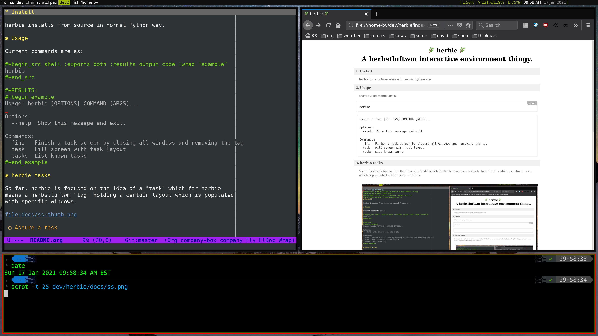

#+title: 🌿 herbie 🌿
#+subtitle: A herbstluftwm interactive environment thingy.
#+export_file_name: index
#+OPTIONS:   H:4 num:nil toc:2
#+setupfile: docs/theme-readtheorg-local.setup

* Intro

*herbie* is persistent helper for adding behavior to [[https://herbstluftwm.org/][herbstluftwm]] by reacting to keybindings and interacting via [[https://github.com/davatorium/rofi][rofi]].

* Documentation

You are reading it.  This file is it.  You can see it rendered in the [[https://github.com/brettviren/herbie/blob/master/README.org][herbie's
github repo]] or more beautifully by Emacs with the help of [[https://github.com/fniessen/org-html-themes][fniessen's ReadTheOrg]]
on [[https://brettviren.github.io/herbie/][herbie's github pages]].

* Installation

*herbie* installs in the usual Python ways.  Direct from GitHub:

#+begin_example
uv tool install git+https://github.com/brettviren/herbie
#+end_example

Or from PyPi

#+begin_example
uv tool install herbstluft-herbie
#+end_example

Note, the project named [[https://pypi.org/project/herbie/][herbie on PyPI]] is not related to this herbie.

* Usage

#+begin_example
$ herbie hooks
#+end_example

Run with no arguments to get help on log and config files and if herbie needs
help to find =herbstclient=.

* Hooks

Once started, *herbie* is long-running process that *reacts* to information from *herbstluftwm* "hooks".  *herbie* can react to standard hooks and custom hooks.  For example,

#+begin_example
$ herbstclient emit_hook window_jump_tag
#+end_example

Or, when herbstlufwm restarts, it emits the ~restart~ hook and *herbie* will react
by restarting itself.  Every hook is handled by a method in the ~Herbie~ class of
hte same name.  See that class for a definitive list but here are some of the
existing hook handlers:

- ~window_jump_tag~ :: opens a rofi menu for jumping to a window in the current tag.

- ~window_jump_any~ :: as above but include all windows across tabs.

- ~window_menu~ :: open a menu on current window to apply some operation (close,
  minimize, toggle some property like floating or fullscreen).

- ~layout_{drop,save,load}~ :: open a menu to operate on layouts (see below)

- ~task_{start,clear}~ :: open a menu to operate on tasks (see below).

Many of the hooks that *herbie* reacts to are most conveniently emitted via a key
binding.  Here is a snippet of =~/.config/herbstluftwm/autostart= that shows some
examples:

#+begin_example
# emit to herbie
hc keybind $Mod-n        emit_hook window_jump_tag
hc keybind $Mod-Shift-n  emit_hook window_jump_any
hc keybind $Mod-w        emit_hook window_menu
# k for kill
hc keybind $Mod-k       emit_hook layout_drop
# capital-K for "keep"?
hc keybind $Mod-Shift-k emit_hook layout_save
# y for yank
hc keybind $Mod-y       emit_hook layout_load
hc keybind $Mod-i       emit_hook task_start
hc keybind $Mod-Shift-i emit_hook task_clear
#+end_example

* Layouts

A "layout" is a description of how herbstluftwm places windows in a tag.  For example, you may see the layout of your current tag with: 

#+begin_example
$ herbstclient dump
(split horizontal:0.5:0 (clients grid:0 0x120000e) (clients grid:0 0x3c00142))
#+end_example

*herbie* has support for managing a persistent store of layouts and applying them.  It does this by presenting the user with a rofi menu in response to the ~layout_{drop,save,load}~ hooks.

The menu items include the layout name as well as a little icon that *herbie* generates to show the geometry of the window outlines.  Here is an example:

[[file:docs/layouts.png]]

Layouts are saved in:

#+begin_example
~/.config/herbie/layouts/<tag>/<name>.layout
#+end_example

The user may create or edit these files by hand but perhaps it is easiest to configure a layout via herbstluftwm and then save it.

#+begin_note
Layouts from ~herbstclient dump~ include a window ID number and these may appear
in ~.layout~ files.  This window ID is ignored by *herbie*.
#+end_note

* Tasks

Tasks are like layouts with added support for starting applications.  The term "task" refers to setting up a space for a user, and not herbie, to perform tasks.  Tasks are configured through the *herbie* config file

#+begin_example
~/.config/herbie/herbie.cfg
#+end_example

A task is specified in a form similar to a herbstluftwm layout but the ~(clients)~ form supports an additional ~window:<name>~ field.  It specifies an application that should exist in the herbstluftwm frame.  This is most clear with an example:

#+begin_example
[window firefox-rss]
title = Mozilla Firefox
command = firefox -P rss-profile

[window liferea]
class = Liferea
command = liferea

[tasks]
rss = (split horizontal:0.75:1
        (clients window:firefox-rss)
        (split vertical:0.50:0
          (clients window:liferea)
          (clients )))

#+end_example

Each ~[window <name>]~ gives a ~command~ to run to populate the frame while the ~class~ or ~title~ gives string that is used to match these client attributes as may be found with, for example:

#+begin_example
herbstclient attr clients.<window-id>.{title,class}
#+end_example

When ~task_start~ hook is received, *herbie* will present a rofi menu with all known tasks.  Selecting one will create a tag with that task, assure the configured applications are present and following the layout and make that tag current.  If the tag already exists, *herbie* will simply make it become the current tag.  
The result is an automatically and repeatably populated tag.

* See also

- https://herbstluftwm.org/ of course.

- A random collection of [[file:docs/tips.org][tips and tricks]] to use herbsluftwm.

* Todo

- [ ] Layouts should be definable in ~herbie.cfg~ and that set should be a union
  of what is manged in ~layouts/~.

- [ ] The task layout should be considered without needing to be redefined
  explicitly as a layout.

- [ ] herbsluftwm 0.9.6 adds a =--binary-pipe= which allows to send multiple
  commands through a single herbstclient instance.  A few of herbie's reactions
  invoke a sequence of herbstclient calls and they may benefit from this
  feature.
