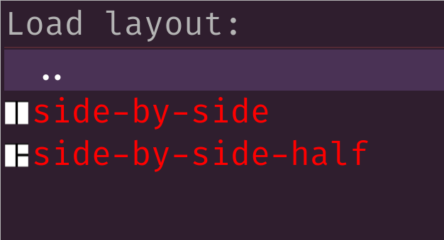
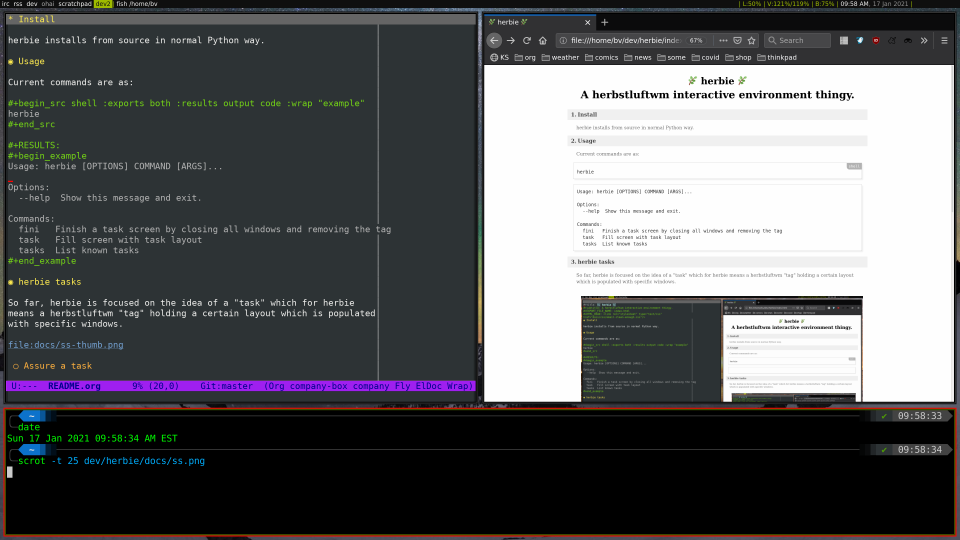

- [Intro](#org5840e35)
- [Documentation](#org33f8399)
- [Installation](#org21720c9)
- [Usage](#orgb14f1ce)
- [Hooks](#orge6a76e0)
- [Layouts](#orge66c3f5)
- [Tasks](#org6f6c533)
- [See also](#org75ee1f3)
- [Todo](#orgb787aab)


<a id="org5840e35"></a>

# Intro

**herbie** is helper for managing a [herbstluftwm](https://herbstluftwm.org/) interactive environment. Interactivity is provide through keybindings and [rofi](https://github.com/davatorium/rofi) and the [rofi-menu](https://github.com/miphreal/python-rofi-menu) Python interface.


<a id="org33f8399"></a>

# Documentation

You are reading it. This file is it. You can see it rendered by [github](https://github.com/brettviren/herbie/blob/master/README.org) or more beautifully by [Emacs](https://brettviren.github.io/herbie/) (with the help of [fniessen's ReadTheOrg](https://github.com/fniessen/org-html-themes))


<a id="org21720c9"></a>

# Installation

**herbie** attempts to be a well behaved Python package so install it as such however you normally do. Recommended:

```
uv tool install git+https://github.com/brettviren/herbie
```

However, you may first need:

```
apt install libgirepository1.0-dev
```

**herbie** is also on PyPI as **herbstluft-herbie**.


<a id="orgb14f1ce"></a>

# Usage

The **herbie** package provides a `herbie` command line program. Run it to print a brief help message:

```
$ herbie
Usage: herbie [OPTIONS] COMMAND [ARGS]...

Options:
  -h, --hc TEXT         Set the herbstclient executable name
  -c, --config PATH     Set configuration file
  -l, --log-file TEXT   Set log file, default is terminal
  -L, --log-level TEXT  Set log level
  --help                Show this message and exit.

Commands:
  hooks    Start herbie loop and respond react to herbstlufwm hooks
  version  Print the version
```


<a id="orge6a76e0"></a>

# Hooks

Once started, **herbie** is long-running and the primary measns to communicate it is with herbstlufwm "hooks". **herbie** will react to standard and custom hooks. For example,

```
$ herbstclient emit_hook window_jump_tag
```

Or, when herbstlufwm restarts, it emits the `restart` hook and **herbie** will react by restarting itself. Every hook is handled by a method in the `Herbie` class of hte same name. See that class for a definitive list but here are some of the existing hook handlers:

-   **`window_jump_tag`:** opens a rofi menu for jumping to a window in the current tag.

-   **`window_jump_any`:** as above but include all windows across tabs.

-   **`window_menu`:** open a menu on current window to apply some operation (close, minimize, toggle some property like floating or fullscreen).

-   **`layout_{drop,save,load}`:** open a menu to operate on layouts (see below)

-   **`task_{start,clear}`:** open a menu to operate on tasks (see below).

Many of the hooks that **herbie** reacts to are most conveniently emitted via a key binding. Here is a snippet of `~/.config/herbstluftwm/autostart` that shows some examples:

```
# emit to herbie
hc keybind $Mod-n        emit_hook window_jump_tag
hc keybind $Mod-Shift-n  emit_hook window_jump_any
hc keybind $Mod-w        emit_hook window_menu
# k for kill
hc keybind $Mod-k       emit_hook layout_drop
# capital-K for "keep"?
hc keybind $Mod-Shift-k emit_hook layout_save
# y for yank
hc keybind $Mod-y       emit_hook layout_load
hc keybind $Mod-i       emit_hook task_start
hc keybind $Mod-Shift-i emit_hook task_clear
```


<a id="orge66c3f5"></a>

# Layouts

A "layout" is a description of how herbstluftwm places windows in a tag. For example, you may see the layout of your current tag with:

```
$ herbstclient dump
(split horizontal:0.5:0 (clients grid:0 0x120000e) (clients grid:0 0x3c00142))
```

**herbie** has support for managing a persistent store of layouts and applying them. It does this by presenting the user with a rofi menu in response to the `layout_{drop,save,load}` hooks.

The menu items include the layout name as well as a little icon that **herbie** generates to show the window outlines in the layout. Here is an example:



Layouts are saved in:

```
~/.config/herbie/layouts/<tag>/<name>.layout
```

The user may create or edit these files by hand but perhaps it is easiest to configure a layout via herbstluftwm and then save it.

<div class="note" id="org3cd3d6e">
<p>
Layouts from <code>herbstclient dump</code> include a window ID number and these may appear
in <code>.layout</code> files.  This window ID is ignored by <b>herbie</b>.
</p>

</div>


<a id="org6f6c533"></a>

# Tasks

Tasks are like layouts with added support for starting applications. They are configured through the **herbie** config file

```
~/.config/herbie/herbie.cfg
```

A task is specified in a form similar to a herbstluftwm layout but the `(clients)` form supports an additional `window:<name>` field. It specifies an application that should exist in the herbstluftwm frame. This is most clear with an example:

```
[window firefox-rss]
title = Mozilla Firefox
command = firefox -P rss-profile

[window liferea]
class = Liferea
command = liferea

[tasks]
rss = (split horizontal:0.75:1
        (clients window:firefox-rss)
        (split vertical:0.50:0
          (clients window:liferea)
          (clients )))

```

Each `[window <name>]` gives a `command` to run to populate the frame while the `class` or `title` gives string that is used to match these client attributes as may be found with, for example:

```
herbstclient attr clients.<window-id>.{title,class}
```

When `task_start` hook is received, **herbie** will present a rofi menu with all known tasks. Selecting one will create a tag with that task, assure the configured applications are present and following the layout and make that tag current. If the tag already exists, **herbie** will simply make it become the current tag. The result is an automatically and repeatably populated tag.

[](docs/ss.png)


<a id="org75ee1f3"></a>

# See also

-   <https://herbstluftwm.org/> of course.

-   A random collection of [tips and tricks](docs/tips.md) to use herbsluftwm.


<a id="orgb787aab"></a>

# Todo

-   [ ] Layouts should be definable in `herbie.cfg` and that set should be a union of what is manged in `layouts/`.

-   [ ] The task layout should be considered without needing to be redefined explicitly as a layout.

-   [ ] The OG **herbie** kept a custom `my_focused_time` window attribute so that it can implement a "switch to last used window" operation. This has become broken in the new async version.

-   [ ] **herbie** modules starting with "a" for "async" are largely current. The rest is mostly cruft remaining from the old, non-async version. It should be integrated or purged.
